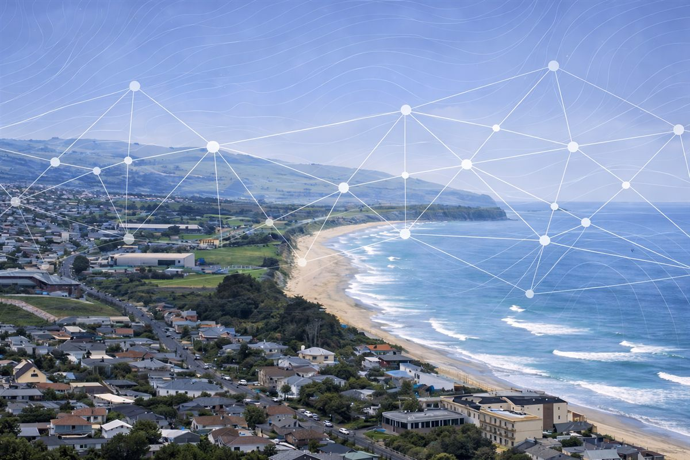

::: {.hero}

::: {.container}
::: {.eyebrow}
Statistics and decision support consultancy
:::

# Southern Clarity NZ

Southern Clarity NZ is a New Zealand-based statistical modelling and decision-support consultancy helping organisations turn complex environmental and operational data into evidence for confident decisions.

::: {.hero-actions}
[Talk to us](contact.qmd){.button}
[What we do](#what-we-do){.button .button-secondary}
:::
:::
:::

::: {.section .container #what-we-do}
## What we do

We deliver end-to-end analytical solutions combining rigorous statistical modelling, reproducible workflows, and interactive decision-support tools.  Our systems evolve as new data becomes available and new management questions emerge.

::: {.template-grid}
::: {.template-card}
### Statistical modelling
Build robust inferential and predictive models to understand environmental systems, quantify uncertainty, and support evidence-based management decisions.
:::

::: {.template-card}
### Decision-support tools
Design interactive dashboards and scenario tools that help teams explore data, compare management options, and act faster.
:::

::: {.template-card}
### Reproducible analytics
Implement transparent, auditable workflows that update as new data and management questions emerge.
:::
:::
:::

::: {.section .container #selected-work}
## Selected work

::: {.case-grid}
::: {.case-card}

### [QGIS workshop for Trap & Trigger Ltd](https://www.linkedin.com/posts/southern-clarity-nz_in-a-recent-hands-on-qgis-workshop-with-the-activity-7421274186452467712-lDe5?utm_source=share&utm_medium=member_desktop&rcm=ACoAAEX2XBgBSKZE8R4cwRq-NoJ4vNfwr0Y45YI){.case-title-link} 
Built reusable mapping workflows for operational teams, including data import standards, geoprocessing patterns, and export-ready outputs to  reduce repeated manual steps. 

<!-- **[Read more →](https://www.linkedin.com/posts/southern-clarity-nz_in-a-recent-hands-on-qgis-workshop-with-the-activity-7421274186452467712-lDe5?utm_source=share&utm_medium=member_desktop&rcm=ACoAAEX2XBgBSKZE8R4cwRq-NoJ4vNfwr0Y45YI){.case-read-more target="_blank" rel="noopener noreferrer"}** -->
:::

::: {.case-card}

### [Kakī population modelling for the Department of Conservation](https://www.linkedin.com/posts/southern-clarity-nz_stefan-recently-had-the-opportunity-to-visit-activity-7418724129924685824-IL-B?utm_source=share&utm_medium=member_desktop&rcm=ACoAAEX2XBgBSKZE8R4cwRq-NoJ4vNfwr0Y45YI){.case-title-link} 
Developed an integrated modelling framework to support long-term planning, quantify uncertainty, and identify where management effort can have the greatest impact.

<!-- **[Read more →](https://www.linkedin.com/posts/southern-clarity-nz_stefan-recently-had-the-opportunity-to-visit-activity-7418724129924685824-IL-B?utm_source=share&utm_medium=member_desktop&rcm=ACoAAEX2XBgBSKZE8R4cwRq-NoJ4vNfwr0Y45YI){.case-read-more target="_blank" rel="noopener noreferrer"}** -->

:::
:::
:::

::: {.section .container #philosophy}
## Why Southern Clarity

::: {.section-intro}
Clarity, rigour, and client ownership are central to every engagement.
:::

::: {.template-grid}
::: {.template-card}
### Client ownership
You retain full ownership of your data, code, and tools.
:::

::: {.template-card}
### Transparent methods
Approaches are documented, reproducible, and easy to communicate to technical and non-technical audiences.
:::

::: {.template-card}
### Decision-ready outputs
Deliverables are designed to support real decisions, not just static analysis reports.
:::
:::
:::

::: {.section .container #who-we-are}
## Who we are

Southern Clarity NZ was co-founded by Stefan Meyer and Anthony Davidson in 2025. Our work is led by strong applied consulting experience in statistical modelling, decision support, and production-ready analytical tool development.

Stefan brings 9+ years of consulting and delivery experience across government and industry contexts, with specialist capability in Bayesian modelling, advanced statistical analysis, and reproducible workflow design. Stefan holds a PhD in Ecology from the University of Otago, New Zealand. EXPAND WITH MORE INFO

Anthony holds a masters degree in Ecology from the University of Otago, New Zealand, and is a registered mathematics teacher. MORE INFO SUCH AS HIS ECOGOLOGY WORK, AI STUFF ETC.

::: {.tool-list}
**Core tools:** R, QGIS, GitHub, Docker, and carefully applied AI-assisted tooling where it improves delivery quality and scalability.
:::
:::
